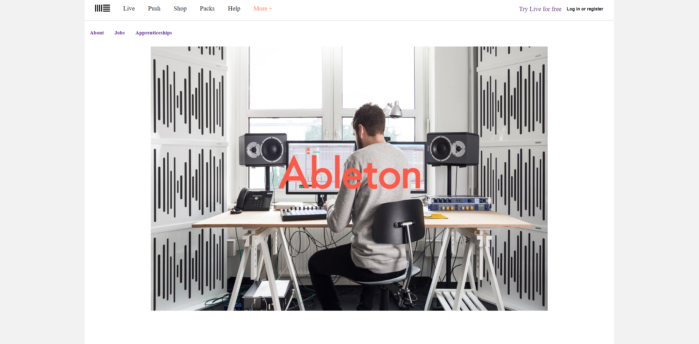

# Frontend Challenges

Este repositorio contiene una colección de ejemplos de **maquetación web**, diseñados para ilustrar diferentes técnicas y enfoques en la construcción de interfaces de usuario. Los ejemplos abordan desde conceptos básicos hasta temas más avanzados.



## Estructura del Repositorio

```
/
├── challenges-frontend/
│   ├── ejemplo1/
│   │   ├── index.html
│   │   ├── styles.css
│   │   └── README.md
│   ├── ejemplo2/
│   │   ├── index.html
│   │   ├── styles.css
│   │   └── README.md
│   └── ...
└──README.md
```

### Abre el archivo index.html en tu navegador para ver el ejemplo.
